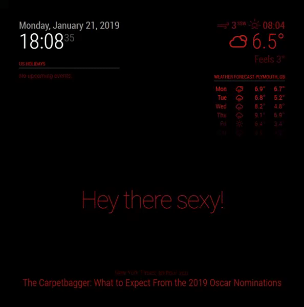

# MMM-Rainbow - Animated text color transition for MagicMirror²

This is a module for the [MagicMirror²](https://github.com/MichMich/MagicMirror/).

Honestly I don't think it will be used but I needed to start somewhere to contribute to the [MagicMirror²](https://github.com/MichMich/MagicMirror/).
The module is very basic and 


## Preview




## Installation
	
Installation is very simple, just clone the git into your modules directory then add the module to your config.

```shell
cd ~/MagicMirror/modules
git clone https://github.com/aSeann/MMM-Rainbow
```

## Using the module

To use this module, add the following configuration block to the modules array in the `config/config.js` file:
```js
var config = {
    modules: [
        {
		module: "MMM-Rainbow",
		/*	Position not required as it has no UI.	*/
		config: {
			fadeTime: 1500,	//	Duration in milliseconds it takes for the color to fade.
			nextColor: 1500,	//	Duration in milliseconds until the next random color is generated and set.
		}
	},
    ]
}
```
